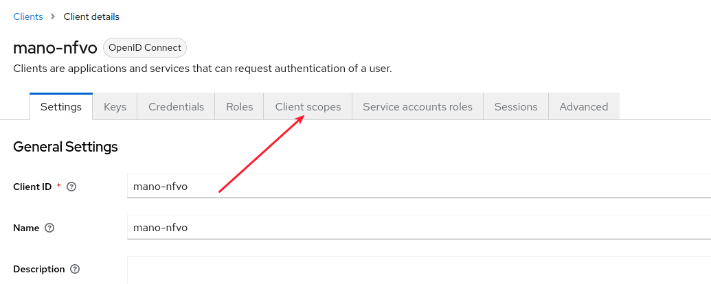
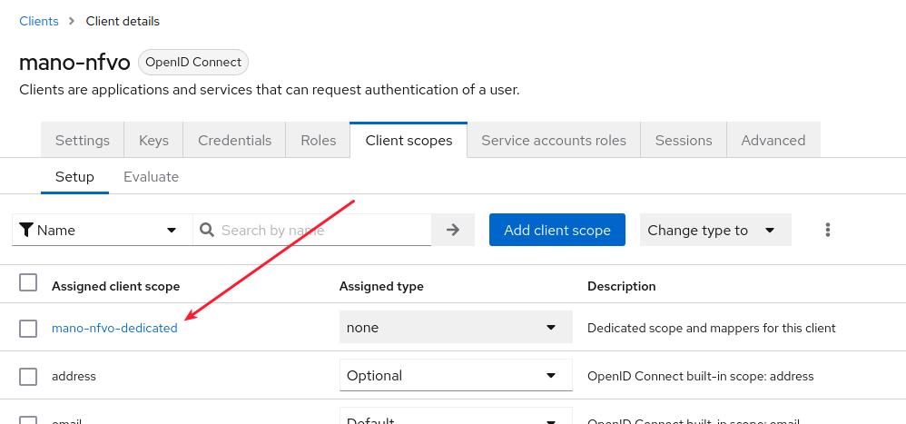
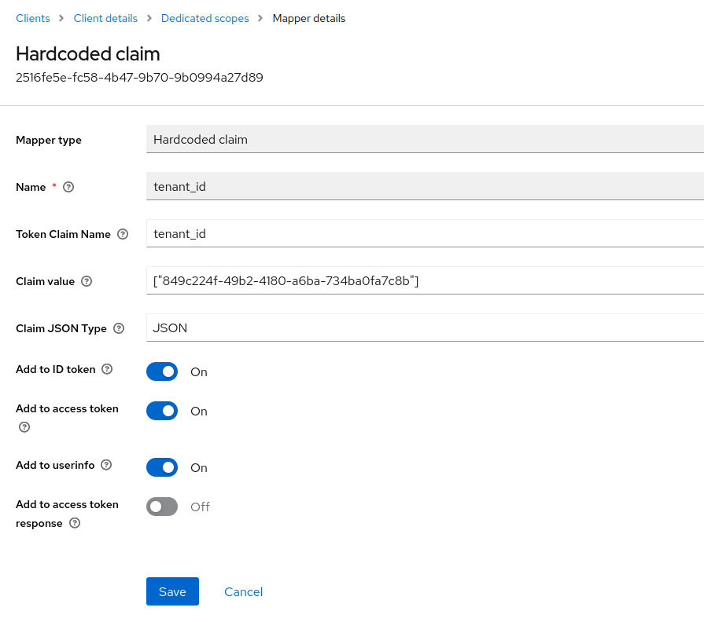

= Multi tenantcy
Multi tenant, allow attribute instances and vim to a given tenant driven by it's credentials.

== OAuth2 (keycloak)
When using OAuth2 module, the TOKEN will be used. In this case the goal is to pass the `tenant_id` in the content of the token. The `tenant_id` is a JSON array containing string with tenant id. This `tenant_id` can be ayn string, and doesn't have any specific meanings.

[source,json]
----
"tenant_id": [
    "849c224f-49b2-4180-a6ba-734ba0fa7c8b"
  ],
----

=== Keycloak guide
Let's login to keycloak, choose your tenant, and edit the correct client.
Then click on `client Scopes`

Then click on `dedicated` link

Then `Add mapper` -> `by configuration`, and then click on `Hardcoded claim`

image::img/Selection_435.png[harcoded claim]

Now just set the name, and claim name to `tenant_id`. In this example the tenant id is `849c224f-49b2-4180-a6ba-734ba0fa7c8b`, but feel free to find a better name according to your needs.

== Basic
Actually, there is no developpement on this topic, as ETSI MANO modern version doesn't support BASIC auth anymore.

== TLS
No developement as been done actualy for TLS authentication. Tehere is many ways to pass the tenant in the cetificates.